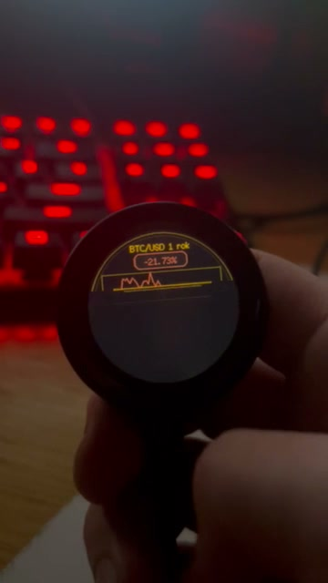
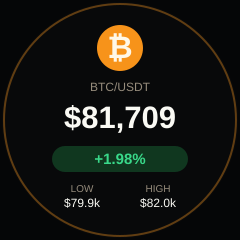
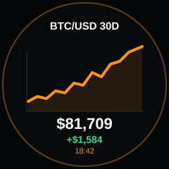
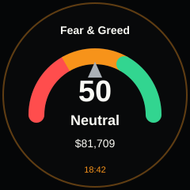
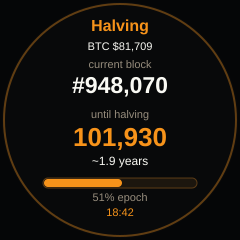
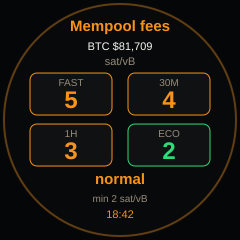
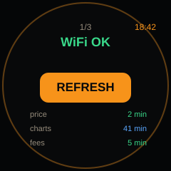
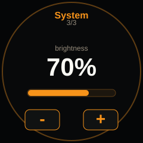
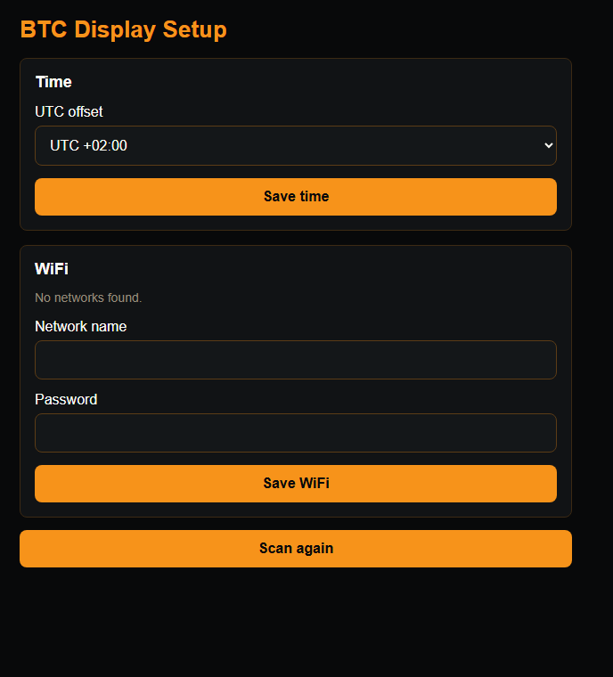

# BTC Display for ESP32-2424S012C-I-Y(B)

Firmware for a small round ESP32-C3 Bitcoin dashboard with touch controls, cached data, Wi-Fi setup over hotspot, and automatic page scrolling.

## Demo

[](https://cdn.jsdelivr.net/gh/MiraKnapovsky/btc-display-esp32-c3@main/assets/btc-display-demo.mp4)

Click the preview to watch the device in action.

## Device

Tested on the black shell `ESP32-2424S012C-I-Y(B)` 1.28 inch capacitive touch circular ESP32 display.

Device listing: [ESP32-C3 1.28 inch circular capacitive touch display](https://www.alibaba.com/product-detail/ESP32-C3-1-28-inch-circular_1601475073494.html)

Hardware used by this firmware:

- MCU: `ESP32-C3-MINI-1U`
- Display: 240 x 240 round `GC9A01` SPI panel
- Touch: capacitive `CST816` compatible controller on I2C address `0x15`
- Display SPI: SCLK GPIO 6, MOSI GPIO 7, DC GPIO 2, CS GPIO 10
- Touch I2C: SDA GPIO 4, SCL GPIO 5, INT GPIO 0, RST GPIO 1
- Backlight: PWM on GPIO 3

## Screens










## Features

- BTC/USDT price with 24 hour movement, high and low
- 24 hour, 30 day and 1 year BTC charts
- Fear & Greed index
- Bitcoin block height and halving countdown
- Mempool fee panel
- Cached data after restart or without internet
- Stale-data dot only when a panel misses its expected refresh window
- Wi-Fi setup hotspot with browser configuration page
- Status menu with `CONNECT`, `HOTSPOT` and `OFFLINE` actions
- Configurable UTC offset
- Display brightness page with tap and hold controls
- Automatic page scrolling every 5 minutes

## Refresh Intervals

| Data | Interval |
| --- | ---: |
| BTC price | 2 minutes |
| 24H chart | 15 minutes |
| 30D chart | 6 hours |
| 1Y chart | 24 hours |
| Fear & Greed | 6 hours |
| Block height | 5 minutes |
| Mempool fees | 5 minutes |

## Wi-Fi Setup

Open the status menu from the left or right edge of the display and tap `HOTSPOT`.

- Setup SSID: `BTC-Display-Setup`
- Setup password: `btcwifi123`
- Browser address: `http://192.168.4.1`

From the setup page, scan nearby networks, choose a 2.4 GHz Wi-Fi network, enter the password, and save. The hotspot stays active while the display connects and turns off shortly after a successful connection.



The setup page can also change the display UTC offset.

## Touch Controls

- Swipe bottom to top or tap lower half: next page
- Swipe top to bottom or tap upper half: previous page
- Tap left or right edge: open or leave the status menu
- Status menu: tap Wi-Fi status or `DETAILS` for Wi-Fi details
- Brightness page: tap or hold `-` / `+`

## Compile-Time Wi-Fi Fallback

The browser setup is preferred, but compile-time credentials can be used as a fallback.

1. Copy `include/secrets.example.h` to `include/secrets.h`.
2. Edit `include/secrets.h`.
3. Use a 2.4 GHz Wi-Fi network.

`include/secrets.h` is ignored by git.

## Build and Upload

This project uses PlatformIO.

```powershell
platformio run -e esp32-c3-devkitm-1
platformio run -e esp32-c3-devkitm-1 -t upload
```

The default `platformio.ini` uses `COM1`. Change `upload_port` and `monitor_port` if your board appears on a different serial port.

## Data Sources

- Price and candles: Binance public API
- Fear & Greed: Alternative.me API
- Blocks and fees: mempool.space API
